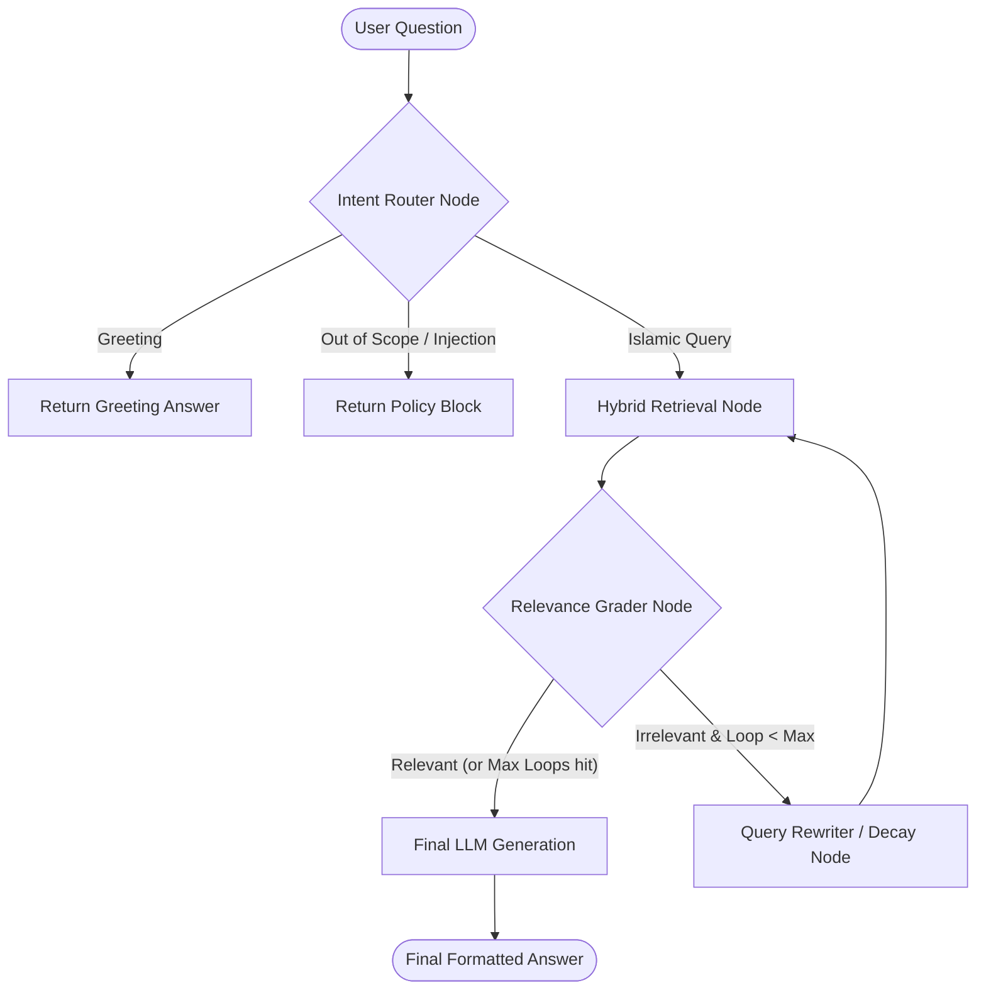

# 🕋 RAG-Hadith: Advanced Islamic Knowledge Retrieval System

RAG-Hadith is a production-grade, modular Retrieval-Augmented Generation (RAG) system specialized in Islamic Hadith Q&A. It features a advanced, state-of-the-art **Agentic RAG pipeline** powered by **LangGraph**, combined with a multi-stage **Hybrid Retrieval (Dense + Lexical)** engine.

The system retrieves authenticated Hadiths along with their scholarly commentaries (*Sharh*), evaluates candidate relevance, automatically resolves colloquial Arabic queries into modern standard search queries, and serves answers generated by state-of-the-art LLMs.

---

## 🚀 Key Features

### 1. Hybrid Retrieval Engine
*   **Dense Semantic Search**: Utilizes a Qdrant vector database initialized with Arabic-specific embeddings (such as `Omartificial-Intelligence-Space/Arabic-Triplet-Matryoshka-V2`).
*   **Lexical (BM25) Search**: Uses a native BM25 index on commentaries for precise keyword matching.
*   **Topic Category Filtering**: Optionally filters the search space by matching the user's intent to high-level categories (e.g., Beliefs, Prayer, Transactions) via a secondary semantic category index.
*   **Hadith-Level Re-Similarity**: Rather than cross-encoder reranking, candidate commentaries are unpacked, and their individual Hadiths are compared directly with the query using SentenceTransformer cosine similarity.

### 2. LangGraph-Driven Agentic Loop
The system can run in standard single-pass RAG mode or **Agentic RAG mode**:

*   **Intent Router Node**: Classifies queries as `islamic`, `greeting`, `injection` (Prompt Injection prevention), or `out_of_scope` to save LLM tokens and safeguard the system.
*   **Hadith Relevance Grader**: Evaluates candidate hadiths in isolation (hadith text only, omitting commentary) to filter out noise.
*   **Step-Back Query Rewriter**: Expands/rewrites failed search queries using context, step-back reasoning, and previous search history.
*   **Decaying Search Parameters**: To narrow down the search space during recursive loops, search counts (`k` and `fetch_k`) decay dynamically with each retry.
*   **RAG Generator**: Synthesizes the verified relevant Hadiths and their full commentaries into a cohesive, structured Arabic response.

### 3. Defense-In-Depth Security
*   **Obfuscation Parsing**: Normalizes zero-width spaces, diacritics (Tashkeel), baseline expansions, and collapses obfuscated character runs (e.g. `ت ج ا ه ل`).
*   **Homoglyph Mapping**: Resolves lookalike Unicode characters (e.g., Cyrillic characters mimicking Latin letters) to bypass prompt injection attempts.
*   **Base64 Decoding**: Scans for Base64 payloads and decodes them for nested inspection.

---

## 📂 Project Structure

```directory
RAG-Hadith/
├── app/                        # FastAPI Application Core
│   ├── api/                    # API Routers & Endpoints
│   │   └── v1/
│   │       ├── endpoints/      # /ask, /retrieve, and /health routers
│   │       └── router.py
│   ├── core/                   # Settings, logging configuration, custom exceptions
│   │   ├── config.py           # Pydantic BaseSettings config schema
│   │   └── logging.py
│   ├── schemas/                # Request and response models (Pydantic)
│   └── services/               # System components and business logic
│       ├── agentic_rag.py      # LangGraph state graph compilation and nodes
│       ├── arabic_utils.py     # Diacritic stripping and character normalization
│       ├── bm25_index.py       # BM25 builders & loaders
│       ├── category_retriever.py # Topic category semantic search
│       ├── embeddings.py       # Embeddings wrappers (HuggingFace / OpenAI)
│       ├── hadith_search.py    # Direct lexical search on clean hadiths
│       ├── llm.py              # LLM factory (SBG, OpenAI, Groq, Ollama, Gemini, etc.)
│       ├── retriever.py        # Central multi-stage hybrid retriever
│       └── security.py         # Obfuscation normalization & injection checkers
├── eval/                       # Evaluation & Benchmark Pipeline
│   ├── config.py               # Evaluation settings
│   ├── evaluator.py            # String overlap, embedding similarity, and LLM matching
│   └── run_eval.py             # Evaluation runner over Bukari benchmarks
├── frontend/                   # Static Client SPA Dashboard
│   ├── index.html              # Main Q&A dashboard
│   ├── settings.html           # RAG parameters configurations
│   ├── duas.html               # Supplications list
│   ├── ahadith.html            # Hadith browsing interface
│   ├── mawaqit.html            # Prayer timings dashboard
│   ├── favorites.html          # Saved resources page
│   └── style.css               # Styling
├── scripts/                    # Maintenance & Indexing Scripts
│   ├── init_index.py           # Embeds dataset chunks and indexes to Qdrant
│   ├── init_bm25.py            # Generates lexical BM25 index on disk
│   ├── init_category_index.py  # Builds high-level category vector index
│   └── init_hadith_index.py    # Builds direct Hadith-level BM25 index
├── notebooks/                  # Experimental Jupyter Notebooks
├── requirements.txt            # Python dependencies
├── Dockerfile                  # API Container Configuration
└── docker-compose.yml          # Container configuration for API, Qdrant, and Redis
```

---

## 🛠️ Configuration & Setup

### 1. Prerequisites
*   Python 3.10 or 3.11
*   Docker & Docker Compose (optional, for containerized database services)

### 2. Environment Setup
Clone the repository and copy the environment template:
```bash
cp .env.example .env
```
Fill out the keys in `.env`:
*   **LLM Provider Settings**: Set `LLM_PROVIDER` (e.g., `sbg`, `openai`, `gemini`, `groq`, `ollama`).
*   **API Keys**: Enter your respective LLM provider API keys (`GOOGLE_API_KEY`, `OPENAI_API_KEY`, `GROQ_API_KEY`, etc.).
*   **Qdrant Settings**: Define your vector store connection details. If running Qdrant locally, the defaults (`localhost:6333`) are ready to go.

### 3. Initialize the Indexes
Before running the server, you must index your dataset. Run the scripts in the following order:

```bash
# 1. Chunk and upload the primary commentary dataset to Qdrant
python scripts/init_index.py

# 2. Build the primary commentary lexical (BM25) index
python scripts/init_bm25.py

# 3. Index high-level categories descriptions to Qdrant
python scripts/init_category_index.py

# 4. Build the direct Hadith-level BM25 search index
python scripts/init_hadith_index.py
```
*Note: Ensure the datasets (e.g. `Hadith_Filtered_Books.csv`, `main_categories_description.csv`) are present in the `data/` directory.*

### 4. Running the Server

#### Option A: Running Locally with Python
Activate your virtual environment, install dependencies, and run via `uvicorn`:
```bash
pip install -r requirements.txt
uvicorn app.main:app --host 127.0.0.1 --port 8000 --reload
```

#### Option B: Running with Docker Compose
To build and spin up the FastAPI service, Qdrant vector database, and Redis cache in containers:
```bash
docker-compose up --build
```

---

## 🖥️ Frontend Dashboard
The user-facing side of the project is a sleek, static SPA located in the `/frontend` directory. 
To run it, simply open `frontend/index.html` in your browser (or use a simple server like Live Server).

**Features**:
*   **QA Dashboard**: Ask questions, toggle **Agentic RAG**, and see streaming-like answers alongside detailed metadata sources.
*   **Settings Screen**: Modify LLM Temperature, system prompts, retrieval sizes (`k`), and switch backend LLM providers in real-time.
*   **Prayer Times, Favorites, and Duas**: Additional utility tabs for daily Islamic rituals.

---

## 🧪 Evaluation Pipeline
The codebase includes a specialized benchmarking pipeline under the `eval/` folder to run retrieval and generation accuracy tests.

To run the evaluation benchmarks:
```bash
python eval/run_eval.py
```

**Evaluation Strategies**:
1.  **Substring match**: Simple normalized character containment.
2.  **Sequence match**: Sequence-based token-level overlap.
3.  **Cosine Embedding Similarity**: Query/Response semantic alignment.
4.  **LLM Fallback**: If standard algorithms fail, an evaluator LLM checks semantic equivalency of the answer against the ground truth.

---

## 📡 API Endpoints

### `POST /api/v1/ask`
Submits a query to the RAG pipeline.

**Request Payload (`AskRequest`)**:
```json
{
  "question": "ما حكم العمل بالنيات؟",
  "k": 5,
  "rewrite": true,
  "use_agentic": true,
  "session_id": "optional-session-id"
}
```

**Response Payload (`AskResponse`)**:
```json
{
  "answer": "إنما الأعمال بالنيات وإنما لكل امرئ ما نوى...",
  "sources": [
    {
      "hadith": "إنما الأعمال بالنيات...",
      "sharh": "هذا الحديث أصل عظيم من أصول الإسلام...",
      "rawy": "عمر بن الخطاب",
      "source": "صحيح البخاري",
      "hokm": "صحيح",
      "page_id": "1",
      "similarity_score": 0.942
    }
  ],
  "query_rewritten": "حكم النية في الأعمال الشرعية",
  "agentic": true,
  "loop_count": 1,
  "query_history": ["ما حكم العمل بالنيات؟", "حكم النية في الأعمال الشرعية"],
  "session_id": "optional-session-id"
}
```

### `POST /api/v1/retrieve`
Retrieves matching hadith documents without generating an LLM response.

### `GET /api/v1/health`
Checks backend and service database readiness.
